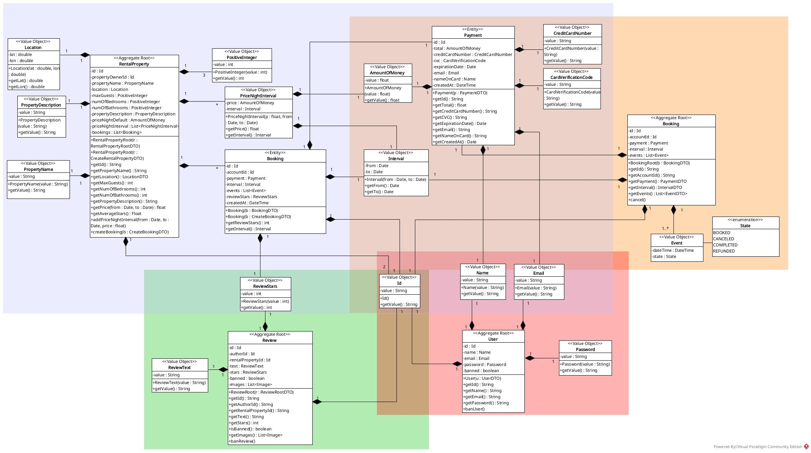
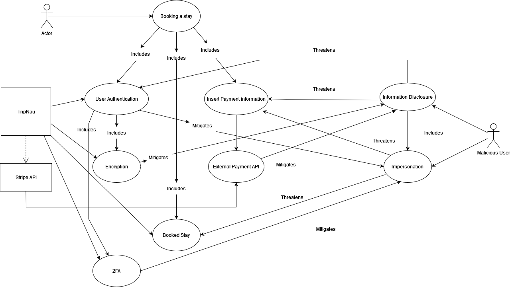

# DESOFS 2024 M1A Group 2 - Phase 1

### Members

- 1190326 - Afonso Machado
- 1190535 - Domingos Machado
- 1230201 - Nuno Ribeiro
- 1230211 - Rui Neto
- 1230212 - Simão Santos

# 1. SSDLC

## 1.1 Analysis (Requirements gathering)

### 1.1.1 Use cases

TripNau is a web application similar to airbnb and booking that aims to ease the process of booking properties for
whatever purpose the customer wants, such as vacations, work, etc. Basically, property owners can easily list their
properties on the platform, setting nightly rates for specific time frames and providing detailed information such as
location, number of bedrooms, bathrooms, and amenities. Then, costumers will be able to scroll
through a list of properties and will have the option to perform bookings for specific time  intervals whenever these are
available. Moreover, the platform facilitates post-stay reviews, allowing users to provide feedback to property owners and
offering insights to potential guests before making a booking.

The following diagram showcases the use cases of the TripNau system.

### 1.1.2 Security related requirements

[Go to Security related requirements Excel](./Requirements_TripNau.xlsx)

## 1.2 Design

### 1.2.1 System architecture

#### 1.2.1.1 Class diagram

The TripNau system employs the Domain-Driven Design (DDD) pattern, which emphasizes the encapsulation of domain logic
within distinct aggregates. These aggregates include 'RentalProperty,' 'Review,' 'Booking,' and 'User.' Each aggregate is
represented by a specific color in the following diagram. This architectural approach enhances clarity, organization,
and maintainability within the system by grouping related components together.

#### 1.2.1.2 Components diagram

This section provides a logical representation of the system architecture for TripNau. The following diagram illustrates
how the TripNau system can be divided into various components with a low level of granularity, as well as the interfaces
provided and required by each component.

The diagram below presents an in-depth view of the backend component of the TripNau system, focusing on its various elements
with a higher level of granularity.

**SecurityFilterChain**: Spring Security maintains a filter chain internally where each of the filters has a particular responsibility and filters
are added or removed from the configuration depending on which services are required (**Chain of responsibility pattern**).
Filters can be used for a number of different purposes, like authentication, authorization, exploit protection, and more
[(ref)](https://docs.spring.io/spring-security/reference/servlet/architecture.html).

Security mechanisms must be designed so that a failure will follow the same execution path as disallowing the
operation [(ref)](https://owasp.org/www-community/Fail_securely). A security filter chain is designed in such a way that
downstream filter instances aren't invoked when there is a failure [(ref)](https://docs.spring.io/spring-security/reference/servlet/architecture.html),
adhering to the **Fail Securely Security Principle**.

**HttpAuthorization**: Spring request authorization components permit the definition of match rules by HTTP method
[(ref)](https://docs.spring.io/spring-security/reference/servlet/authorization/authorize-http-requests.html).
This adheres to the **Least Privilege Security Principle**.

**InputSanitizer**: Ensures that an input to a system function does not trigger an unexpected and unauthorized behavior.

**InputValidator**: Performs abstract level validations with no domain considerations.

#### 1.2.1.3 Deployment diagram

Since this is a web application, the client-server architecture was adopted, and in order to relieve the processing load on the
Backend, acting as a gateway, a Middleware component was created that is responsible for filtering out requests that should
not reach the Backend, e.g. requests for authenticate routes that carry invalid tokens. In addition, the Middleware component
is also responsible for sanitizing and validating the payloads of the requests on a technical level, e.g. ensuring that
strings meet the minimum size or that requests with excessively large strings do not reach the Backend.

The Backend, in turn, will be responsible for carrying out all the validation at business level. This component will only
accept requests from Middleware and will therefore ignore all requests from other sources. The database that the Backend
communicates with is hidden from the outside world, being on a private network. This component is also responsible for
communicating with two external APIs in order to fulfill the necessary business flows, in this case the Stripe API and the
Twilio API.

Finally, there is the Logs component, which is included in the entire system, as it is responsible for receiving all the
actions carried out in the system and thus recording everything according to a standard. In order not to block any part of
the system, a message broker was added to the communication, so that actions can be written and read asynchronously.

### 1.2.2 Threat model (Software-Centric approach)

#### 1.2.2.1 Application decomposition

##### 1.2.2.1.1 Threat Model Information

**Application Version**: 1.0

This website is designed for the travel sector, focusing on facilitating the purchase of stays from customer to customer,
emphasizing a peer-to-peer C2C model while excluding commercial entities in this first implementation. The platform supports
three distinct user roles:

- Customer
- Property Owners
- System Admins

Property owners will be able to login and have access to features that allows them to register a new property and view
the booking history for their listings. Users, on the other hand, can browse through a list of available properties without
login, but will be able to login and initiate booking processes, and provide feedback through reviews. System admins will
be able to login and play a role in approving reviews and managing the properties submitted to the platform.

##### 1.2.2.1.2 External dependencies

<table>
  <tr>
    <th>ID</th>
    <th>Description</th>
  </tr>
  <tr>
    <td>1</td>
    <td>The TripNau system will run on docker containers. All the images should be verified.</td>
  </tr>
  <tr>
    <td>2</td>
    <td>The system will utilize a MySQL database for data storage. Communication between the backend application and the MySQL database will be secured over TLS.</td>
  </tr>
  <tr>
    <td>3</td>
    <td>The system will integrate with the Stripe API for managing booking payments securely.</td>
  </tr>
  <tr>
    <td>4</td>
    <td>Message notifications will be managed using the Twilio API to ensure reliable communication with users.</td>
  </tr>
  <tr>
    <td>5</td>
    <td>All system logs will be saved to a Syslog server for auditing and monitoring purposes.</td>
  </tr>
  <tr>
    <td>6</td>
    <td>The system backend and middleware will be developed using Spring Boot, utilizing its libraries extensively.</td>
  </tr>
  <tr>
    <td>7</td>
    <td>The system frontend will be built using Angular.js, leveraging its libraries for dynamic user interfaces.</td>
  </tr>
  <tr>
    <td>8</td>
    <td>Communications between backend and middleware, and between middleware and frontend will be secured using HTTPS to ensure data confidentiality and integrity.</td>
  </tr>
  <tr>
    <td>9</td>
    <td>Integration with RabbitMQ as a message broker using the AMQP protocol will be used for handling asynchronous communication between the backend application and message broker, between the logger from frontend and the message broker, and between message broker and the logging application.</td>
  </tr>
  <tr>
    <td>10</td>
    <td>The system deployment will heavily rely on Github actions.</td>
  </tr>
  <tr>
    <td>11</td>
    <td>The source code will be managed on the Github version control system.</td>
  </tr>
</table>

##### 1.2.2.1.3 Entry points

<table>
  <tr>
    <th>ID</th>
    <th>Name</th>
    <th>Description</th>
    <th>Trust Levels</th>
  </tr>
  <tr>
    <td>1</td>
    <td>HTTPS Port</td>
    <td>The booking website will only be accessible via TLS. All pages within the website are layered on this entry point.</td>
    <td>(1) Anonymous Web User, (2) Customer, (3) Property Owner, (4) Business admin</td>
  </tr>
  <tr>
    <td>1.1</td>
    <td>Website home page</td>
    <td>The splash page for the booking website is the entry point for all users.</td>
    <td>(1) Anonymous Web User, (2) Customer, (3) Property Owner, (4) Business admin</td>
  </tr>
  <tr>
    <td>1.2</td>
    <td>Login Page</td>
    <td>Customers, property owners and business admins must log in to the booking website before they can carry out any of the use cases.</td>
    <td>(1) Anonymous Web User, (2) Customer, (3) Property Owner, (4) Business admin</td>
  </tr>
  <tr>
    <td>1.2.1</td>
    <td>Login Function</td>
    <td>The login function accepts user supplied credentials and compares them with those in the database.</td>
    <td>(1) Anonymous Web User, (2) Customer, (3) Property Owner, (4) Business admin</td>
  </tr>
  <tr>
    <td>1.2.1.1</td>
    <td>Two factor authentication Function</td>
    <td>The two factor authentication function accepts user information and guarantee that is correct.</td>
    <td>(2) Customer, (3) Property Owner, (4) Business admin</td>
  </tr>
  <tr>
    <td>1.2.2</td>
    <td>Reset password function</td>
    <td>The reset function accepts all users, since they provide a valid email.</td>
    <td>(1) Anonymous Web User, (2) Customer, (3) Property Owner, (4) Business admin</td>
  </tr>
  <tr>
    <td>1.3</td>
    <td>Signup Page</td>
    <td>Customers and properties owners that don't have credentials must register in order to realize the login.</td>
    <td>(1) Anonymous Web User, (2) Customer, (3) Property Owner, (4) Business admin</td>
  </tr>
  <tr>
    <td>1.3.1</td>
    <td>Signup function</td>
    <td>The Signup function accepts any registration data and guarantee that is a valid account before creating a new user.</td>
    <td>(1) Anonymous Web User</td>
  </tr>
  <tr>
    <td>1.4</td>
    <td>Properties entry page</td>
    <td>The page used to visualize properties.</td>
    <td>(2) Customer, (3) Property Owner, (4) Business admin</td>
  </tr>
  <tr>
    <td>1.4.1</td>
    <td>Property search function</td>
    <td>The page used to search for properties.</td>
    <td>(2) Customer, (3) Property Owner, (4) Business admin</td>
  </tr>
  <tr>
    <td>1.5</td>
    <td>Property detail page</td>
    <td>The page used to specify detail information about the property.</td>
    <td>(2) Customer, (3) Property Owner, (4) Business admin</td>
  </tr>
  <tr>
    <td>1.5.1</td>
    <td>Book property function</td>
    <td>The book function accepts the user information and guarantees that all the information is valid and correct.</td>
    <td>(2) Customer</td>
  </tr>
  <tr>
    <td>1.6</td>
    <td>Own bookings page</td>
    <td>The page used by customers to see their bookings.</td>
    <td>(2) Customer</td>
  </tr>
  <tr>
    <td>1.6.1</td>
    <td>Write property's review function</td>
    <td>The write property's review function accepts the review information and guarantees that all the information is valid and correct.</td>
    <td>(2) Customer</td>
  </tr>
  <tr>
    <td>1.7</td>
    <td>Own property list page</td>
    <td>The page used to list the properties owned by a property owner.</td>
    <td>(3) Property Owner</td>
  </tr>
  <tr>
    <td>1.7.1</td>
    <td>Create new property function</td>
    <td>The create new property function accepts the property input and validates in order to guarantee that is valid.</td>
    <td>(3) Property Owner</td>
  </tr>
  <tr>
    <td>1.7.2</td>
    <td>Delete a property function</td>
    <td>The delete a property function a property as input and verify if exists in the database.</td>
    <td>(3) Property Owner</td>
  </tr>
  <tr>
    <td>1.8</td>
    <td>Pending review list page</td>
    <td>The page where is possible to see the pending reviews.</td>
    <td>(4) Business admin</td>
  </tr>
  <tr>
    <td>1.8.1</td>
    <td>Approve/Reject review function</td>
    <td>The approve/reject review function takes information about one review and verify if exists in the database.</td>
    <td>(4) Business admin</td>
  </tr>
</table>

##### 1.2.2.1.4 Exit points

<table>
  <tr>
    <th>ID</th>
    <th>Name</th>
    <th>Description</th>
    <th>Trust Levels</th>
  </tr>
  <tr>
    <td>1</td>
    <td>HTTPS Port (Response)</td>
    <td>The response from the booking backend, served via LTS.</td>
    <td>(1) Anonymous Web User, (2) Customer, (3) Property Owner, (4) Business administrator</td>
  </tr>
  <tr>
    <td>2</td>
    <td>Login Status</td>
    <td>Error messages returned to the user via the the log in page might allow for entry point attacks, such as account harvesting (username not found), and SQL injection (SQL exception errors).</td>
    <td>(1) Anonymous Web User, (2) Customer, (3) Property Owner, (4) Business administrator</td>
  </tr>
  <tr>
    <td>3</td>
    <td>Register Status</td>
    <td>Error messages returned to the user via the the register page might allow for entry point attacks, such as account harvesting (username not found), and SQL injection (SQL exception errors).</td>
    <td>(1) Anonymous Web User, (2) Customer, (3) Property Owner, (4) Business administrator</td>
  </tr>
  <tr>
    <td>4</td>
    <td>Reset Password Status</td>
    <td>Error messages returned to the user via the the reset password returned status page might allow for entry point attacks.</td>
    <td>(1) Anonymous Web User, (2) Customer, (3) Property Owner, (4) Business administrator</td>
  </tr>
  <tr>
    <td>5</td>
    <td>Create Rental Property returned page</td>
    <td>The rental property page returned to the user after creation might allow for entry point attacks.</td>
    <td>(3) Property Owner</td>
  </tr>
  <tr>
    <td>6</td>
    <td>Owned Bookings List returned page</td>
    <td>The list of updated owned bookings returned to the user after the creation might allow for entry point attacks.</td>
    <td>(2) Customer, (3) Property Owner</td>
  </tr>
  <tr>
    <td>7</td>
    <td>Cancel a Stay Status</td>
    <td>When a user cancels a stay, a page with the confirmation is returned and it might allow for entry point attacks.</td>
    <td>(2) Customer</td>
  </tr>
  <tr>
    <td>8</td>
    <td>Create Review returned page including image submission</td>
    <td>The updated reviews page returned to the user after the review with image creation might allow for entry point attacks.</td>
    <td>(2) Customer</td>
  </tr>
  <tr>
    <td>9</td>
    <td>Error Messages</td>
    <td>Error messages displayed all over the pages in response to failed actions attempts. These messages might inadvertently disclose information about the existence of important information.</td>
    <td>(1) Anonymous Web User, (2) Customer, (3) Property Owner, (4) Business administrator</td>
  </tr>
</table>

##### 1.2.2.1.5 Assets

| ID    | Name                                                | Description                                                                                                                                                               | Trust Levels                                                                                                                                                                              |
|-------|-----------------------------------------------------|---------------------------------------------------------------------------------------------------------------------------------------------------------------------------|-------------------------------------------------------------------------------------------------------------------------------------------------------------------------------------------|
| 1     | User related data                                   | Assets related to user information.                                                                                                                                       |                                                                                                                                                                                           |
| 1.1   | Auth details for TripNau users                      | The login credentials that a costumer, property owner or a business admin will use to log into the TripNau.                                                               | (2) Customer  (3) Property owner  (4) Business admin  (5) Backend server user process  (6) Middleware server user process  (10) DB read/write user  (11) DB admin |
| 1.2   | User payment data                                   | Credit card related data such as credit card number and card verification code.                                                                                           | (2) Customer  (3) Property owner  (5) Backend server user process  (6) Middleware server user process  (10) DB read/write user  (11) DB admin                         |
| 1.3   | User booking related data                           | Booking information such as dates, status, etc.                                                                                                                           | (2) Customer  (3) Property owner  (5) Backend server user process  (6) Middleware server user process  (10) DB read/write user  (11) DB admin                         |
| 1.4   | Read access to property related data                | Property to book information such as available dates, price per night, num of bedrooms, etc.                                                                              | (1) Anonymous user  (3) Property owner  (5) Backend server user process  (6) Middleware server user process  (10) DB read/write user  (11) DB admin                   |
| 1.5   | Read/Write access to property related data          | Full access to property related data.                                                                                                                                     | (3) Property owner  (5) Backend server user process  (6) Middleware server user process  (10) DB read/write user  (11) DB admin                                           |
| 2     | System                                              | Assets related to the underlying system.                                                                                                                                  |                                                                                                                                                                                           |
| 2.1   | Availability of the TripNau                         | TripNau should be available 24 hours a day and be accessible by all it's users.                                                                                           | (5) Backend server user process  (6) Middleware server user process  (11) DB admin                                                                                            |
| 2.2   | Ability to execute code as a backend server user    | This is the ability to execute source code on the backend server as a server user.                                                                                        | (5) Backend server user process                                                                                                                                                           |
| 2.3   | Ability to execute SQL as a DB Read/Write user      | This is the ability to execute SQL. Select, insert, and update queries on the database and thus have read and write access to any information stored within the Database. | (10) DB read/write user                                                                                                                                                                   |
| 2.4   | Ability to request Stripe API                       | This is the ability to perform requests to the Stripe API with the purpose of creating check out sessions.                                                                | (5) Backend server user process                                                                                                                                                           |
| 2.5   | Ability to request Twilio API                       | This is the ability to perform requests to the Twilio API with the purpose of sending e-mails and messages.                                                               | (5) Backend server user process                                                                                                                                                           |
| 2.6   | Ability to execute code as a middleware server user | This is the ability to execute source code on the middleware server as a server user.                                                                                     | (6) Middleware server user process                                                                                                                                                        |
| 2.7   | Ability to request backend server                   | This is the ability to request the backend provided endpoints                                                                                                             | (6) Middleware server user process                                                                                                                                                        |
| 2.8   | Ability to put messages into the message broker     | This is the ability to enqueue log messages into the message broker                                                                                                       | (9) Message queue write user                                                                                                                                                              |
| 2.9   | Ability to read messages from the message broker    | This is the ability to dequeue log messages from the message broker                                                                                                       | (8) Message queue read user                                                                                                                                                               |
| 3     | Infrastructure                                      | Assets related to infrastructure access                                                                                                                                   |                                                                                                                                                                                           |
| 3.1   | Access to the Database server                       | Gives full access to the data contained within the database                                                                                                               | (11) DB admin                                                                                                                                                                             |
| 3.2   | Access to Audit data                                | Audit data shows all the events that occurred in the TripNau system                                                                                                       | (7) Logs admin                                                                                                                                                                            |
| 3.3   | Access to the backend server                        | Full access to the machine where the backend server is hosted                                                                                                             | (5) Backend server user process                                                                                                                                                           |
| 3.3.1 | Access to API keys and secrets                      | Access to sensitive data that serves as authentication to third party's among other secrets                                                                               | (5) Backend server user process                                                                                                                                                           |
| 3.4   | Access to the middleware server                     | Full access to the machine where the middleware server is hosted                                                                                                          | (6) Middleware server user process                                                                                                                                                        |

##### 1.2.2.1.6 Trust Levels

<table>
  <tr>
    <th>ID</th>
    <th>Name</th>
    <th>Description</th>
  </tr>
  <tr>
    <td>1</td>
    <td>Anonymous web user</td>
    <td>A user that has connected to the website but hasn't provided credentials.</td>
  </tr>
  <tr>
    <td>2</td>
    <td>Customer</td>
    <td>The customer can see the booking list, see their personal information, and book a stay. Also, they can submit reviews of bookings that they stayed.</td>
  </tr>
  <tr>  
    <td>3</td>
    <td>Property owner</td>
    <td>A property owner can register a new property to be booked, see their personal information and see the bookings that are associated with their properties.</td>
  </tr>
  <tr>  
    <td>4</td>
    <td>Business administrator</td>
    <td>The business admin can approve or reject reviews sent by users, as the properties sent by the properties owners.</td>
  </tr>
  <tr>  
    <td>5</td>
    <td>Backend server user process</td>
    <td>This is the user responsible for the backend process execution.</td>
  </tr>
  <tr>  
    <td>6</td>
    <td>Middleware server user process</td>
    <td>This is the user responsible for the middleware process execution.</td>
  </tr>
  <tr>  
    <td>7</td>
    <td>Logs administrator</td>
    <td>The administrator can analyze the logs and be notified of alerts originated by the log system.</td>
  </tr>
    <tr>  
    <td>8</td>
    <td>Message queue read user</td>
    <td>The user only has access to dequeue messages.</td>
  </tr>
    <tr>  
    <td>9</td>
    <td>Message queue write user</td>
    <td>The user only has access to enqueue messages.</td>
  </tr>
  <tr>  
    <td>10</td>
    <td>DB read/write user</td>
    <td>The user that only has access to read/write queries.</td>
  </tr>
  <tr>
    <tr>  
    <td>11</td>
    <td>DB user admin</td>
    <td>The user that has permissions to administrate the database.</td>
  </tr>
</table>

##### 1.2.2.1.7 Data Flow Diagrams

[Go to threat model report](./ThreatDragon/threat-model-report.pdf)

#### 1.2.2.2 Rank and determination of threats

##### 1.2.2.2.1 Threat Categorization (STRIDE)

[Go to threat model report](./ThreatDragon/threat-model-report.pdf)

##### 1.2.2.2.2 Threat Analysis

###### 1.2.2.2.2.1 Abuse Cases

<table>
  <tr>
    <th>ID</th>
    <th>Abuse Case</th>
    <th>Description</th>
  </tr>
  <tr>
    <td>1</td>
    <td>As a malicious user, I will perform an injection attack on the application</td>
    <td>This includes injection attacks like XSS, SQL Injection, OS commands, among others.</td>
  </tr>
  <tr>
    <td>2</td>
    <td>As a malicious user, I will try to access other's accounts.</td>
    <td>This can include brute force attacks, dictionary tool attacks</td>
  </tr>
  <tr>
    <td>3</td>
    <td>As a malicious user, I will try to manipulate property ratings</td>
    <td>This can include removal of negative reviews or usage of bots to add positive/negative reviews on a property</td>
  </tr>
  <tr>
    <td>4</td>
    <td>As a malicious user, I will try to evade review monitoring</td>
    <td>This can be done by trying to manipulate reviews after they have been monitored. Another way would be review bombing and flooding the moderators queue.</td>
  </tr>
  <tr>
    <td>5</td>
    <td>As a malicious user, I will try to access restricted areas without proper permission.</td>
    <td>This might be done by trying to log into an admin account with default credentials, or simple trying to reach restricted zones directly using a default account.</td>
  </tr>
  <tr>
    <td>6</td>
    <td>As a malicious user, I will try to register a property without owning it.</td>
    <td>This can be either registering properties that aren't his or even that don't exist all.</td>
  </tr>
  <tr>
    <td>7</td>
    <td>As a malicious user, I will try to delete my property without refunding any bookings made to it.</td>
    <td>This means that a malicious user will try to delete his property's listing without any intention to refund the bookings made to it.</td>
  </tr>
  <tr>
    <td>8</td>
    <td>As a malicious user, I will try to edit a property's information without owning it</td>
    <td>This means that the malicious user might try to edit someone else's property from his account or even try to enter the owners account to edit the information.</td>
  </tr>
  <tr>
    <td>9</td>
    <td>As a malicious user, I will try to delete a property without actually owning it.</td>
    <td>This means that the malicious user might try to delete someone else's property from his account or even try to enter the owners account to delete it.</td>
  </tr>
  <tr>
    <td>10</td>
    <td>As a malicious user, I will try to refund a booking after having already stayed there</td>
    <td>This can mean he will try to refund the booking during or after the stay.</td>
  </tr>
  <tr>
    <td>11</td>
    <td>As a malicious user, I will try to view the bookings made by other people</td>
    <td>This can be mean he will try to access other peoples details/bookings page or even try to forge requests to the API</td>
  </tr>
  <tr>
    <td>12</td>
    <td>As a malicious user, I will try to upload an image in a review with too big of a size</td>
    <td>This can lead to a downtime on the server as it processes the image data as it is too big</td>
  </tr>
  <tr>
    <td>13</td>
    <td>As a malicious user, I will try to upload an image with faulty metadata</td>
    <td>A malicious user might include malicious scripts in the image metadata that can be executed if it isn't properly treated</td>
  </tr>
  <tr>
    <td>14</td>
    <td>As a malicious user, I will try to simulate cancelling a booking to attempt to get a refund</td>
    <td>This can mean the user will try to get a refund without cancelling the stay.</td>
  </tr>
  <tr>
    <td>15</td>
    <td>As a malicious user, I will try to book a stay on dates where the property is already booked</td>
    <td>This can mean the user will try to override another user's stay.</td>
  </tr>
</table>

###### 1.2.2.2.2.2 Use and Abuse Case Graphs

The action of logging in as a user is prone to several types of attacks and there are many abuse cases associated with it. In order to mitigate these attacks the application should make sure not to show too much information on login failure as well as lock the account after 3 failure attemps. The amount of time locked out should be incremental as a way to mitigate dictionary attacks. As a way to prevent these attacks, 2FA is also in place.

The action of leaving a review can be used by both normal users as a way to show their liking on a booking, but it can also be used by malicious users as a way to influence the ratings on a property, giving it a better rating or worse according to their intents. As a counter-measure to this, the system should validate if users actually stayed in the property to be able to leave a review. Another thing users might do is alter reviews after the first moderation process done by a admin, as a way to leave review that don't follow TOS. For this a review versioning should be in place where whenever a review is altered it can go by an automatic reviewal process and eventually if necessary a manual one.

Booking a stay involves the input of a lot of sensitive data from the user including his personal information as well as payment details. This information is usually a target for attackers and needs to be properly secured.
In order to protect it Authentication is required to book stays which includes encryption of the data as well as 2FA, ensuring that, if a user has payment information associated to their account, even if the account login details are compromised, the payment data won't.
When booking a stay the user will perform the payment through the Stripe API, which in itself offers security measures, abstracting the requests with the data from the application, making it harder for bad actors to steal it.
2FA also helps in preventing unauthorized bookings in case a user, for example, leaves his account logged on in an unprotected machine.

Similarly to booking stays, viewing booked stays can expose sensitive data. The same techniques are applied here.
However, viewing a user's booked stays opens up paths to exploits. 
If a nefarious user has access to an account they might attempt to cancel a booked stay and divert the refunds to an account they control which is why 2FA is once again used as another layer of confirmation before a user is able to cancel their stay.
On the other hand, if a malicious actor manages to gain access to an account with special privileges they might try to cancel another user's stay to try and book their own. Therefore the authentication of moderator/admin accounts has layers of protection to try and ensure their use by authorized personell only.

##### 1.2.2.2.3 Ranking of Threats

[Go to threat model report](./ThreatDragon/threat-model-report.pdf)

#### 1.2.2.3 Countermeasures and Mitigation

[Go to threat model report](./ThreatDragon/threat-model-report.pdf)

## 1.3 Other artifacts

### 1.3.1 Tests Plan

[Go to Tests Plan Excel](./TestsPlan_TripNau.xlsx)

### 1.3.2 ASVS

[Go to ASVS Excel](./ASVS_TripNau.xlsx)