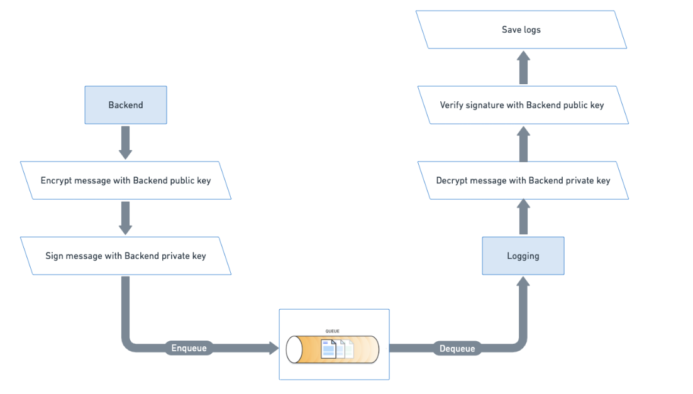
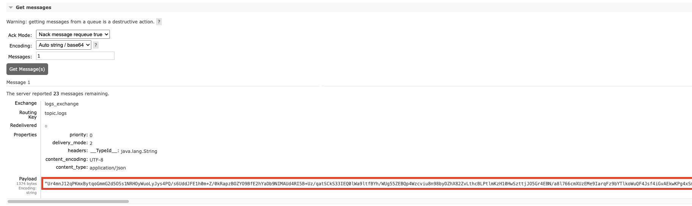
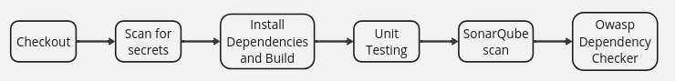
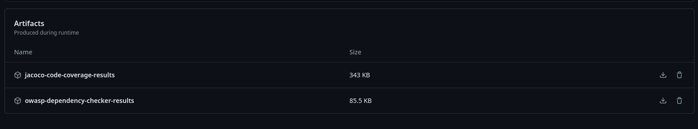
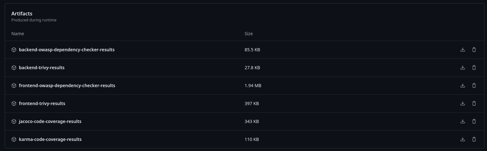
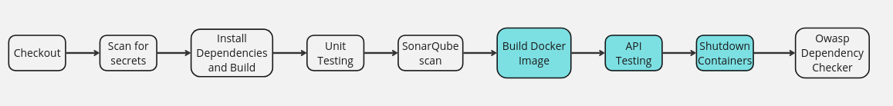
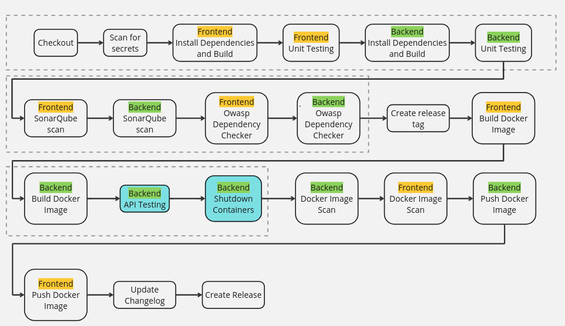

# DESOFS 2024 M1A Group 2 - Phase 2

### Members

- 1190326 - Afonso Machado
- 1190535 - Domingos Machado
- 1230201 - Nuno Ribeiro
- 1230211 - Rui Neto
- 1230212 - Simão Santos
  
# Index

- [DESOFS 2024 M1A Group 2 - Phase 2](#desofs-2024-m1a-group-2---phase-2)
    - [Members](#members)
- [Index](#index)
  - [Frontend](#frontend)
    - [Components](#components)
      - [Register](#register)
      - [Login](#login)
    - [Home](#home)
    - [Booking](#booking)
    - [Interceptors](#interceptors)
    - [Guards](#guards)
    - [Tests](#tests)
    - [Middleware](#middleware)
      - [Rate Limiter Interceptor](#rate-limiter-interceptor)
      - [Input Sanitizer Interceptor](#input-sanitizer-interceptor)
      - [Authentication Interceptor](#authentication-interceptor)
  - [Backend](#backend)
    - [DDD, Immutability, DTOs](#ddd-immutability-dtos)
    - [JWT and Statelessness](#jwt-and-statelessness)
    - [Encryption](#encryption)
    - [Security Chain](#security-chain)
    - [JWT Filter chain](#jwt-filter-chain)
    - [HTTP Size Limiter](#http-size-limiter)
    - [Http Statuses](#http-statuses)
    - [XSS Prevention](#xss-prevention)
    - [Rate Limiter Interceptor](#rate-limiter-interceptor-1)
    - [IP Filter](#ip-filter)
    - [SQL query parameterization](#sql-query-parameterization)
    - [Validations](#validations)
    - [Tests](#tests-1)
    - [Controller Advisor](#controller-advisor)
    - [HTTPS](#https)
    - [Pawned password checker](#pawned-password-checker)
    - [Two-Factor Authentication (2FA)](#two-factor-authentication-2fa)
    - [Images Upload](#images-upload)
    - [Secure management of secrets using environment variables](#secure-management-of-secrets-using-environment-variables)
    - [Payments](#payments)
    - [Update and Forgot Password](#update-and-forgot-password)
  - [Logging](#logging)
  - [DevSecOps](#devsecops)
    - [Pipelines](#pipelines)
    - [Dependabot](#dependabot)
    - [Security Policy](#security-policy)
    - [API testing automation](#api-testing-automation)
      - [Test for Poison Messages](#test-for-poison-messages)
      - [Unauthorized Access](#unauthorized-access)
      - [XSS](#xss)
      - [Rate Limiter](#rate-limiter)
      - [Man-in-the-Middle Attack](#man-in-the-middle-attack)

## Frontend 

Although the frontend addresses some of the security aspects in  the application, these can be easily surpassed as a UI is not required to communicate with the server. The frontend was designed in a way that it will handle user interactions and minimize the wrong interactions one might have with the application, however it isn't sufficient a safeguard for the application. In this section of the report, we talk about the components of the frontend and their functionalities, angling more on the security aspects of them.

### Components

#### Register

When a user is registering in the application, he is required to give the basic information about himself, including name, email and intended role.
The email given by the user is positively validated with the RegEx present in the OWASP validation RegEx repository <https://owasp.org/www-community/OWASP_Validation_Regex_Repository>

```ts
const EMAIL_REGEXP = /^[a-zA-Z0-9_+&*-]+(?:\.[a-zA-Z0-9_+&*-]+)*@(?:[a-zA-Z0-9-]+\.)+[a-zA-Z]{2,}$/;

if (!EMAIL_REGEXP.test(this.form.controls.email.value!)) {
    this.form.controls.email.setErrors({ email: true })
    valid = false;
}
```

The user is also required to insert a password that follows the minimum requirements by OWASP taken from the same repository.

```ts
this.passwordRequirements = [
    { requirement: 'At least 12 characters long', fulfilled: false },
    { requirement: 'Less than 128 characters long', fulfilled: false },
    { requirement: 'Contains at least one lowercase letter', fulfilled: false },
    { requirement: 'Contains at least one uppercase letter', fulfilled: false },
    { requirement: 'Contains at least one digit', fulfilled: false },
    { requirement: 'Contains at least one special character', fulfilled: false },
    { requirement: 'No more than 2 equal characters in a row', fulfilled: false }
];

checkPasswordRequirements(password: string): void {
    this.passwordRequirements[0].fulfilled = password.length >= 12;
    this.passwordRequirements[1].fulfilled = password.length < 128;
    this.passwordRequirements[2].fulfilled = /[a-z]/.test(password);
    this.passwordRequirements[3].fulfilled = /[A-Z]/.test(password);
    this.passwordRequirements[4].fulfilled = /\d/.test(password);
    this.passwordRequirements[5].fulfilled = /[!@#$%^&*]/.test(password);
    this.passwordRequirements[6].fulfilled = !/(.)\1{2,}/.test(password);
  }
```

The password is validated to make sure it has at least 12 characters and doesn't exceed 128. It is also required to have at least one special character, one upper case character, one lower case character and one digit. It also can't have more two characters in a row.

#### Login

When a user tries to log into the application, the e-mail is also positively validated the same way as when registering.
As a way to prevent brute-force attacks from the front-end, the user is timed-out in an exponential manner, ranging from 30 seconds after failing the loggin 3 times, and a full hour whenever the user fails to login 15 or more times.

```ts
const timeouts: number[] = [30 * 1000, 60 * 1000, 300 * 1000, 900 * 1000, 3600 * 1000];
const timeoutsStrings: string[] = ['30  seconds', '1 minute', '5 minutes', '15 minutes', '1 hour']

function handleLoginResponse(response: LoginResponse) {
    if (response.token) {
      this.router.navigateByUrl('/home');
    } else {
      this.failedAttempts += 1;
      if (this.failedAttempts === 3) {
        this.disabled = true;
        if (this.totalFailedAttempts < this.timeouts.length) {
          this.timeout = this.timeouts[this.totalFailedAttempts]
          this.timeoutString = this.timeoutsStrings[this.totalFailedAttempts]
        } else {
          this.timeout = this.timeouts[this.timeouts.length - 1]
          this.timeoutString = this.timeoutsStrings[this.timeoutsStrings.length - 1]
        }
        setTimeout(() => {
          this.form.setErrors({ tooManyFailures: true })
          this.disabled = false;
        }, this.timeouts[this.totalFailedAttempts])
        this.failedAttempts = 0;
        this.totalFailedAttempts++;
      } else {
        this.form.setErrors({ invalidCredentials: true })
      }
    }
  }
```

The login request is sent by the authentication service who then handles the response and parses the JWT token that comes in the headers.

```ts
function login(credentials: LoginRequest): Observable<LoginResponse> {
    return this.http.post<LoginResponse>(environment.apiUrl + '/auth' + ROUTE.LOGIN, credentials, { observe: 'response' }).pipe(
      map((response: HttpResponse<LoginResponse>) => {
        if (response.headers.get('Authorization')) {
          this.setToken(response.headers.get('Authorization')!)
        }
        return response.body!;
      })
    )
  }
```

Whenever a login is successful, the application stores the token in the authentication service service and in the browsers local storage, in the case of the user not being an administrator. The token saved in the local storage is to allow for a user to close the tab and re-open it while still keeping it's logged in status as the application checks for tokens in the local storage on boot, however this would be a security breach in the case of a user with admin credentials and therefore the token isn't stored in such cases.

```ts
ngOnInit(): void {
    if (localStorage.getItem('token')) {
      this.authService.setToken(localStorage.getItem('token')!);
    }
    this.messagesService.getMessages().subscribe((message) => this.messageService.add(message))
  }
```

### Home

The landing page of the application. After a user authenticates they get access to a list of the properties they have available to rent as well as some information about them such as location, cost, etc.
This page is meant as a hub for most functionalities of the application. It also works as a return for most of the other applications when they conclude and therefore it's routing is intertwined with authenticationguards, restricting what each user is allowed to do.

### Booking

When a user clicks on a property to rent they're taken to a page containing the option to rent a property for an interval of time. This page follows the same information model as the home page allowing for a request to the database to be skipped.
When trying to rent a property the user is required to insert valid dates and in the future a guest list might be required, otherwise a request to the back-end will not be sent.
When a valid booking is generated, the back-end validates the information as well as the validity of the selected dates. In the future the user might be alerted as to what dates are valid.
This prevents abuse of the requests on a first level, as well as prevents a user overriding another's booked stay.
All these actions are also guarded by authentication.

### Interceptors

Interceptors in Angular are functions that act on the request chain, acting between the HttpClient and the HttpBackend and are able to interact with the request sent in order to perform actions that should be performed on all requests. This is a functionality that eases the addition of Security headers to the requests being sent, and can also be used to sanitize the requests information and to limit the amount of requests being sent.

In this interaction the interceptors implemented were the rate limiting interceptor and the authentication interceptor.
The authentication interceptor communicates with the authentication service and for every request checks if the user is authenticated in which case it will add the user name to the headers of the request along with with the token. This interceptor also adds some other headers to prevent the caching of information like Pragma and Cache-Control.

```ts
export const authInterceptor: HttpInterceptorFn = (req, next) => {
  const authService = inject(AuthService)

  const appendHeaderIfMissing = (headers: HttpHeaders, header: string, value: string): HttpHeaders => {
    if (headers.has(header)) return headers
    return headers.append(header, value);
  }

  let headers = req.headers;

  headers = appendHeaderIfMissing(headers, 'Pragma', 'no-cache')
  headers = appendHeaderIfMissing(headers, 'Cache-Control', 'no-cache')

  if (authService.getUser()) {
    headers = appendHeaderIfMissing(headers, 'user', authService.getUser()!);
  }
  if (authService.getToken()) {
    headers = appendHeaderIfMissing(headers, 'Authorization', 'Bearer ' + authService.getToken())
  }

  return next(req.clone({ headers }));
};
```

The rate limiting interceptor works in a similar way to the Token Bucket Algorithm, where each request sent will cost a token from the "bucket" and these tokens are refilled after X amount of time, inspired by the article from Hiresh Trivedi on Designing a Distributed Rate Limiter <https://medium.com/wineofbits/designing-a-distributed-rate-limiter-deep-dive-76d7e8d8452d>.

This interceptor will be the first to be triggered in the interceptor chain and will act as a safeguard against the overuse of the server. It will try to consume one token from the service (up to a maximum of 60 per minute) and in the case where it can, the request can proceed, whereas in the opposite case an exception will be returned to inform the user that he needs to chill.

```ts
export const rateLimitingInterceptor: HttpInterceptorFn = (req: HttpRequest<any>, next: HttpHandlerFn) => {
  const service = inject(RateLimitingService)
  if (service.tryConsume()) {
    return next(req);
  } else {
    return new Observable<HttpResponse<any>>(observer => {
      observer.error(new HttpResponse({
        status: 429,
        statusText: 'Too Many Requests',
        body: { error: 'Rate Limit Exceeded' }
      }));
    });
  }
};
```

### Guards

A guard is the component responsible for safeguarding certain routes of the application according to some conditions. In our case, we used an authentication guard that would validate if the user is authenticated and then check if the role that the user has is in the list of required roles to access that route. Whenever a user isn't authenticated he is routed to the login page, and if he doesn't have permissions to access the route he tried to access the route will return false and he will stay in the same page.

```ts
export function authGuard(requiredRoles: Array<string>) {
  const guard: CanActivateFn = () => {
    const authService = inject(AuthService);
    const router = inject(Router)

    if (!authService.isAuthenticated()) {
      router.navigateByUrl('/login')
      return false;
    }

    if (requiredRoles.length == 0) return true;
    const roles = authService.getRoles();
    let authorizide = false;
    
    requiredRoles.forEach((role) => {
      if (roles.includes(role)) authorizide = true
    })

    return authorizide;
  };
  return guard;
}
```

### Tests

The testing of the application is also a crucial part in ensuring the functionality and security of the whole. However due to time constraints, not all features were properly tested as the main focus for this iteration was the adoption of a pipeline that is fully functional. For this reason, the tests were more focused on security related functionalities like the rate limiting interceptor and auth interceptor.

### Middleware

#### Rate Limiter Interceptor

This interceptor is present both on the frontend and on the backend. Although it might seem redundant, limiting the rate of requests a user can place on both the client and server side will lessen the load that the server is handling by a lot and allow it to run smoothly and remain capable of processing and validating the requests of other users.
This interceptor was built in a similar way both on the frontend and on the backend, having a maximum number of requests that each user can send, and whenever a user reaches his this limit, the requests he sends will be rejected with the Http Status 429 Too Many Requests.

#### Input Sanitizer Interceptor

This interceptor is present only on the frontend, with a similar implementation on the backend in the form of a request filter. The input sanitizer interceptor validates the users input with dictionaries to filter out possible Cross-Site Scripting or SQL Injection attacks, responding with a Http Status 400 Bad Request. It also validates the size of the request's payload and any request which exceeds 2MB will be rejected with a Http Status 413 Payload Too Large.

#### Authentication Interceptor

This interceptor is present only on the frontend and is there to add the Authorization header to every request being sent to the server, and other Client-side Data Protection headers like Pragma and Cache-Control.

## Backend

### DDD, Immutability, DTOs

The decision was made to employ the DDD pattern for domain modeling, considering the benefits it offers in safeguarding business logic. However, it's acknowledged that such approaches entail some drawbacks, such as increased computational overhead in mapper execution. Nonetheless, they bring significant advantages by ensuring a clear separation of concerns and promoting a more maintainable and scalable architecture. With that it was preserve the immutability along all the project to guarantee a more secure way to communicate and work with objects from all project.

In the communications aspect, the transfer of DTOs has been stipulated to ensure that only strictly necessary data is transmitted, providing greater control and security in transactions. Thus, it is possible to work with complete data internally, while externally only the essential is known.

### JWT and Statelessness

For authentication and authorization, **we decided to use JSON Web Token (JWT)**. JWT is a compact, URL-safe means for securely transmitting information, such as user information and token validity between our frontend and backend applications.

Our JWT consists of three parts: the header, the payload, and the signature. The header contains the signing algorithm used (RS256). The payload holds the claims, which are the user ID, the expiration date (created based on role), the email and the role. Lastly, the signature ensures that the token hasn't been altered. It's created by taking the encoded header and payload, along with a secret key, and hashing them together **using the algorithm specified in the header**.

JWTs are widely used in modern web applications due to their benefits, **such as enabling stateless authentication mechanisms**. Since the our tokens contain all necessary information about the user's session, there's no need to maintain session information server-side.

Our workflow involving JWT starts with the client sending authentication credentials to the server. Upon successful authentication, the server generates a JWT with the user information (id, email and role) and an expiration date, signs it, and sends it back to the client. The client then stores the token, and includes the JWT in the HTTP Authorization header using the Bearer schema for subsequent requests to protected resources defined in our `SecurityConfig` file. Our backend verifies the token's signature and checks its claims to ensure validity before granting access to the requested endpoint.

As we know the JWT tokens must be used securely to prevent vulnerabilities, the RSA keys were kept in the `.env` file.

### Encryption

Encrypting passwords was a critical aspect of securing our users data. By converting plain text passwords into a secure, unreadable format before storing them in a database, encryption enhances security by protecting passwords from unauthorized access.

Even if an attacker gains access to the database, the encrypted passwords **are not useful without the decryption key**, significantly reducing the risk of password theft. Our encrypted passwords ensure data integrity, as the original passwords cannot be altered or tampered with; any changes to the encrypted data would render it invalid when decrypted.

Encryption also mitigates the risk of various attacks, **such as brute-force and dictionary attacks**, by making passwords stored in an encrypted format far more resistant to these hacking techniques. In our  code, we use a `PasswordEncoder` interface from the `Spring Security` framework to encrypt user passwords before storing them in the database.

This happens in the `create` method of the `UserService` class, where the password is encoded using the `PasswordEncoder.encode` method before being saved.

### Security Chain

Given that the backend was developed using Spring Boot, it is a best practice to utilize well-established and tested libraries and frameworks that offer security and reliability, such as [Spring Security](https://spring.io/projects/spring-security).

Spring Security is a framework responsible for managing the authentication and access control processes, serving as the standard in this area for Spring-based applications. This framework operates through layers, where all requests received by the server are processed by different layers, each with a specific role, allowing for a customizable security chain.

For our application, Spring Security will be fundamental for handling authentication via JWT, configuring CORS, protecting against CSRF, rate limiting, HTTP payload posing messages, encoding XSS prevention, and so on. At a high level, Spring Security functions based on the reception and response to HTTP requests. Each request passes through a series of layers, each with distinct responsibilities. Depending on the outcome at each layer, the request either advances or is blocked by an exception.

### JWT Filter chain

For our case, we will need to use the `JwtAuthenticationFilter` to decode and process the token, managing authentication and authorization based on its contents. Additionally, we need to implement a `UsernamePasswordAuthenticationFilter` to authenticate users during their active sessions. It is also crucial to configure a routing mechanism to ensure that users making requests have the necessary authorization. Below, we describe the steps taken to ensure secure and authenticated communication:

To decode the JWT token, we created a filter responsible for extracting the token from the Authorization header and decoding it. This allows us to verify whether the user is communicating with a valid token and to determine their authorization level within the system. We established three levels of authorities: Business Admin, Property Owner, and Customer. For the encoding/decoder process we used the NimbusJwt library implementation that gives confidence given that the popularity. This process creates a `Authorization` object that caries out all the information about the user, like the username and the roles that user has.

With the user authenticated is now possible to do the routing where we say what are the authorities that we are allowing:

```java
      .requestMatchers(HttpMethod.GET, "/rental_property/{id}").permitAll()
      .requestMatchers(HttpMethod.POST, "/rental_property/create").hasAuthority(Authority.PROPERTYOWNER)
      .requestMatchers(HttpMethod.GET, "/rental_property/allByUser/{id}").hasAnyAuthority(Authority.PROPERTYOWNER, Authority.BUSINESSADMIN)
```

Nonetheless, there is cases where exist the necessity to refine more the authorization scope, like in the case of, for example, deactivating a rental property, each can be done by the authority Property Owner and Admin, however we need to ensure that a only the real Property Owner can change their own property. For that, we work with the object `Authentication` that it was created on the JWT chain process to the controller and proceed the following logic:

```java

    @DeleteMapping("/{id}")
    public ResponseEntity<FetchRentalPropertyDto> delete(@PathVariable final String id,
                                                         final Authentication authentication){

       ...

        String userId = authentication.getName();
        FetchRentalPropertyDto rentalProperty = this.rentalPropertyService.findById(id);

        if (!rentalProperty.getPropertyOwner().equals(userId) && !hasAuthorization(authentication, Authority.BUSINESSADMIN)) {
            throw new NotAuthorizedException("The request user is not the owner of rental property.");
        }

      ...
    }
```

### HTTP Size Limiter

A potential attack involves sending an unexpectedly large amount of data in a single request, causing significant overhead in the serialization process and impacting the performance for all connected clients. For example, this could occur if a user sends a massive string in a field where only a first name is expected.

Only validating request sizes at the controller or domain servers is inefficient because it requires full serialization of the request to check the content. To optimize this, we added a Filter (`RequestSizeFilter.java`) to the `Security Filter Chain` that checks the content length of incoming requests. If a request's size exceeds a default value, for example 2MB, the filter returns a 413 status code, indicating that request is too large and avoiding the overhead on the serialization process. Is possible to see and example of the response bellow:

```json
{
    "timestamp": "2024-06-08T00:13:14.401013",
    "status": 413,
    "error": "Payload Too Large",
    "message": "Request size exceeds the configured maximum",
    "path": "https://localhost:8080/auth/login"
}
```

While this filter method prevents oversized payloads checking only the request size, it cannot have a fine-grained observation on each specific field, and because of that it might block real requests. Therefore, we complement this by performing input validation on the controller side after serialization. For example, using `Jakarta` validation, we check the size of specific fields in order to obtain a fine-grained control over the request size:

```java
// ...

    @NotNull
    @Size(min = 12, max = 128, message = "Password must be between 12 and 128 characters")
    private final String password;

// ...
```

### Http Statuses

| HTTP Status Code | Description |
|------------------|-------------|
| `200 OK` | Standard response for successful HTTP requests. |
| `201 CREATED` | The request has been fulfilled and has resulted in one or more new resources being created. |
| `400 Bad Request` | The server could not understand the request due to invalid syntax / The request was potentially dangerous. |
| `403 Forbidden` | The client does not have access rights to the content. |
| `404 Not Found` | The server can not find the requested resource. |
| `409 Conflict` | Indicates that the request could not be processed because of conflict in the current state of the resource. |
| `413 Payload Too Large` | Indicates that the request the user sent includes a payload which is too large being considered potentially dangerous. |
| `429 Too Many Requests` | The user has sent too many requests in a given amount of time. |

```json
{
    "timestamp": "2024-06-08T17:51:23.0766144",
    "status": 429,
    "error": "Too Many Requests",
    "message": "User customer@mail.com has exceeded his request rate of 60",
    "path": "/rental_property/create"
}
```

### XSS Prevention

To prevent XSS attacks, our backend logic encodes information, treating everything as an HTML-encoded string that is harmless when rendered in the browser. Additionally, we have implemented security headers to notify the browser about potential XSS issues:

<table>
  <thead>
    <tr>
      <th>Header</th>
      <th>Setting</th>
      <th>Description</th>
    </tr>
  </thead>
  <tbody>
    <tr>
      <td>X-XSS-Protection</td>
      <td>1; mode=block</td>
      <td>Enables XSS filtering. Rather than sanitizing the page, the browser will prevent rendering if an attack is detected. [Mozilla Docs]</a></td>
    </tr>
    <tr>
      <td>Content-Security-Policy</td>
      <td>script-src 'self'</td>
      <td>Adds a Content-Security-Policy header to allow scripts only from the same origin, enhancing security by mitigating the risk of XSS attacks. [Mozilla Docs]</a></td>
    </tr>
  </tbody>
</table>

The encoding logic ensures that data is treated as text rather than code. To achieve this, we created a Filter (`XSSFilter.java`) added to the `Security Filter Chain`, responsible for analyzing all inputs and encoding all strings to ensure safety. However, certain fields and endpoints, such as GET requests and the password field (which is encrypted and never shown or rendered in the database), are excluded from this encoding process.

We use the [OWASP Java Encoder](https://owasp.org/www-project-java-encoder/), which transforms potentially unsafe input like:

```json
{
    ...
    "propertyDescription": "<script>alert('Unsafe action')</script>",
    ...
}
```

Into:

```json
{
    ...
    "propertyDescription": "&lt;script&gt;alert(&#39;Unsafe action&#39;)&lt;/script&gt;",
    ...
}
```

### Rate Limiter Interceptor

This interceptor is present both on the frontend and on the backend. Although it might seem redundant, limiting the rate of requests a user can place on both the client and server side will lessen the load that the server is handling by a lot and allow it to run smoothly and remain capable of processing and validating the requests of other users.
This interceptor was built in a similar way both on the frontend and on the backend, having a maximum number of requests that each user can send, and whenever a user reaches his this limit, the requests he sends will be rejected with the Http Status 429 Too Many Requests.

### IP Filter

This filter is present on the backend and is responsible for capturing and storing the IP address of the client making the request, which is used in the Logging Service to keep track of the requests information.

When a request comes in, the filter extracts the client's IP address and stores it in the ThreadLocal variable. After the request has been processed and the response is ready to be sent, the filter removes the IP address from the variable to minimize memory and possible information leaks. This ensures that the IP address is not kept longer than necessary and that each request has its own isolated IP address.

### SQL query parameterization

Given that Injection vulnerabilities are highlighted by the OWASP Top 10 Risks, it is crucial to focus on preventing SQL Injection. To address this, we used a robust and well-known ORM like JPA. However, it is essential to ensure that we are following the correct patterns for parameterization, as proposed by the [OWASP SQL Injection Prevention Cheat Sheet](https://cheatsheetseries.owasp.org/cheatsheets/SQL_Injection_Prevention_Cheat_Sheet.html). To accomplish this, we ensure that all queries use parameters and none of them use plain text Query API Builders, like shown bellow with the use of `:parameter`:

```java
    @Query("SELECT pni FROM price_night_interval pni WHERE pni.rentalPropertyId=:rentalPropertyId")
    List<PriceNightIntervalDB> findByRentalPropertyId(String rentalPropertyId);
```

### Validations

When it comes to validating user input, `Spring Boot` provides strong support for this common, yet critical, task straight out of the box. Those validations were essential for ensuring that the data provided by the user to our backend application met specific criteria before processing. Spring Boot leverages `Bean Validation`, a powerful and flexible framework, to facilitate this. Bean Validation, which is part of the Java EE and Jakarta EE platforms, **allowed us to annotate our domain model with constraints and validation rules**.

Just as an example, we used the `@Email` and `@NotNull` annotations in the `email` input that - this criteria is ensured by the `@Valid` annotation in the `AuthController`.

### Tests

Testing the software is a crucial part of ensuring security. To achieve this, we created unit tests focusing on the domain objects to guarantee that all domain logic is correct and, also, that exceptions are thrown as expected. Our design ensures that the domain and services fail gracefully by throwing exceptions, which are then handled by a ControllerAdvisor to catch all exceptions effectively.

Another important aspect is integration testing, which ensures that all parts of the system work well together. Although this was not completed in the first milestone due to time constraints, it is scheduled for the second milestone. For this phase, we plan to use [TestContainers](https://testcontainers.com/) to support database containers, and use mock framework with the logic of mocking the controller.

### Controller Advisor

One critical aspect for secure and reliable applications is handling exceptions in a manner that prevents sensitive information from being exposed to potential attackers. Exposing detailed error messages, such as SQL exceptions or stack traces, **can provide attackers with valuable information about the system's internals**, which they can exploit to find vulnerabilities and launch attacks. By abstracting error messages, **we mitigate this risk**, providing a more secure environment.

To address this issue, we implemented a global exception handler in our Spring Boot application. This handler ensures that detailed error information is logged internally while only generic messages are exposed to end-users.

Additionally, this method improves the user experience by presenting clear, user-friendly error messages rather than technical jargon or detailed error stacks, **which can be confusing and frustrating for users**. It also simplifies the maintenance of the application by centralizing exception handling, allowing developers to manage all exceptions in a single place, ensuring consistent error responses and making the codebase cleaner and easier to understand.

The implementation involves a `ControllerAdvisor` class annotated with `@ControllerAdvice`. This class includes methods to handle various types of exceptions, such as `MethodArgumentNotValidException`, `NotFoundException`, `BadCredentialsException`, `NotAuthorizedException`, and general exceptions. For each exception type, a corresponding method constructs an `ErrorPayloadMessage` object, which contains the timestamp, status, error type, message, and request path.

The `ControllerAdvisor` class uses methods to extract the request path, create error payloads, and format error messages. Specific `@ExceptionHandler` methods handle different types of exceptions, returning appropriate HTTP statuses and generic messages.

### HTTPS

To ensure secure communication and prevent *Man in the middle*  attacks between the client and API, we implemented HTTPS using TLS certificates. This approach ensures that all data transmitted is encrypted and secured.

We obtained a TLS certificate (self-signed certificated) to enable encrypted communication. 

After that configuration, HTTPS safeguards all type of information, ensuring that it cannot be intercepted or tampered from anyone except the client of that open communication.

### Pawned password checker

With the goal to increase the security of passwords used by our users, it was considered important to check if the user's password is found in databases of previously leaked passwords.

This process relied on the data from [Have I Been Pwned](https://haveibeenpwned.com/Passwords), which has a database of over 613 million passwords. Instead of using the provided API due to cost considerations, we opted to handle the API functionality internally, utilizing a physical file containing the SHA-1 hashes of these passwords. This file was acquired through the [PwnedPasswordsDownloader](https://github.com/HaveIBeenPwned/PwnedPasswordsDownloader).

Given that this is an academic project, only a portion of the file was used. In a real-world scenario, a possible solution could be the creation of an new service that serves an API responsible for indexing the information for better performance, as using the physical file is not the optimal solution.

To perform the comparison, the user's enters the password, which is  encrypted to a SHA-1 hash, and will be then compared with the hashes in the file. If a match is found, the user it will be notified by the HTTP request and must try again with a new password.

### Two-Factor Authentication (2FA)

Two-Factor Authentication (2FA) is a security mechanism that requires two distinct forms of identification **before granting access to an application or service**. It is designed to enhance the security of an application by ensuring that even if one factor (such as a password) is compromised, **unauthorized access is still prevented due to the second factor**.

The two factors typically used in 2FA are:

Something we know: in our case, a 6 digit PIN.
Something we have: in our case, a phone number that will receive the "One-Time Passcode" (OTP) - the PIN.

> 2FA significantly reduces the risk of unauthorized access by adding an additional layer of security. Even if an attacker obtains the user’s password, **they still cannot access the account without the second factor**.

In our DataNau application, 2FA has been implemented using [Twilio’s Verify API](https://www.twilio.com/docs/verify/api) to send OTPs to users’ mobile phones. The process involves two main steps: generating an OTP and verifying the OTP during login.

- Step 1: Generating the OTP

The generateOTP endpoint is responsible for generating and sending an OTP to the user's phone number.

```java
Verification verification = Verification.creator(twilio_service_sid, user.getPhoneNumber(), "sms").create();
```

- Step 2: Verifying the OTP During Login

The login endpoint handles the verification of the OTP and the user’s credentials.

```java
VerificationCheck verificationCheck = VerificationCheck.creator(twilio_service_sid).setTo(request.getPhoneNumber()).setCode(request.getCode()).create();
```

### Images Upload

Managing file uploads effectively **is crucial for several reasons**:

- **Security**: File uploads can be a major security risk if not handled properly. Malicious users can upload files with hidden scripts or viruses, which can be executed on the server or client-side, leading to data breaches and system compromise.

- **Storage Management**: Uploaded files can consume significant storage space. Proper management ensures that storage resources are used efficiently, preventing excessive disk usage and potential server performance degradation.

- **Data Integrity**: Ensuring that uploaded files are valid and not corrupted is essential for maintaining the integrity of the data associated with them. This includes verifying file types and sizes.

The endpoint `@PostMapping("/review/add")` is defined to handle HTTP POST requests for adding a `Review`. This endpoint accepts a list of images associated with the review.

It checks if the review text exceeds 250 characters and throws an `IllegalArgumentException` if it does. After, it calls `areImagesValid` to validate the uploaded images. This method ensures that no more than three images are uploaded, each image is less than 1MB, **and each image's metadata is checked to ensure it does not contain executable code**.

*Metadata Validation*

`isValidImageMetadata` reads the image's metadata and checks for the presence of script nodes using `containsScriptNode`. **This prevents the upload of images with embedded scripts**.

```java
private boolean containsScriptNode(Node node) {
    if (node.getNodeType() == Node.TEXT_NODE) {
        String textContent = node.getTextContent();
        return textContent.contains("script") || textContent.contains("<script>");
    } else {
        NodeList children = node.getChildNodes();
        for (int i = 0; i < children.getLength(); i++) {
            if (containsScriptNode(children.item(i))) {
                return true;
            }
        }
    }
    return false;
}
```

Image Storage:

Images are stored in `src/main/resources/static/images`, ensuring they are accessible via a URL.
The `saveImageToStorage` method handles the actual file saving. After saving the images, URLs are constructed for each image, **and these URLs are saved to the database**, linking them to the review.

By implementing these measures, the code ensures that file uploads are handled securely and efficiently. Proper validation, error handling, and storage management are key to maintaining the integrity and security of the application, providing a reliable and safe user experience.

### Secure management of secrets using environment variables

Managing secrets and configuration details such as API keys, database credentials, and other sensitive information securely is a critical aspect of application development and deployment. Storing these secrets directly in the source code **can lead to significant security vulnerabilities**. To mitigate these risks, we utilized a `.env` file to manage our secrets, ensuring they do not appear in the source code.

In our Spring Boot application, the `application.yml` file is used to configure various components of the application, including the data source, RabbitMQ, Stripe, and others. To avoid exposing secrets, we reference environment variables in a configuration file.

This file is excluded from version control using `.gitignore`, ensuring that sensitive information does not get committed to the repository.

### Payments

TripNau relies on the Stripe payment API to handle booking payments. This decision is rooted in the need for Payment Card Industry (PCI) compliance, as managing payments autonomously would entail storing private and sensitive information, thus necessitating adherence to strict security standards. By leveraging a trusted third party like Stripe, TripNau can offload the responsibility of managing payment data while ensuring compliance with PCI regulations. When a user initiates a payment, a backend request is made to the Stripe API, which generates a Stripe checkout session. This session includes metadata defined by the backend, detailing the payment information and it's specific to the checkout session. Upon successful payment, Stripe triggers a predefined webhook on the backend application. This webhook reads the metadata from the request to process and store the booking appropriately.

Since the metadata includes sensitive information such as the user ID, details about the stay (e.g., the number of days), and other domain-specific information, sharing this data with third parties poses a security risk. If Stripe were to be compromised, our application could be indirectly exploited as well. To mitigate this risk, the metadata sent in the request to create the Stripe checkout session is encrypted. This encrypted metadata is then decrypted when the webhook call is received, ensuring that sensitive information is protected throughout the process.

Another major concern identified during the implementation of this process was securing the webhook endpoint from malicious users. The webhook is a critical point of entry because it handles inserting bookings into the database. If an attacker were to make a request to this endpoint, they could potentially create a booking without paying for it. To address this issue, Stripe generates a unique key, which is included in the "Stripe-Signature" header. The backend webhook endpoint is designed to verify this key before proceeding. The endpoint checks if the key in the "Stripe-Signature" header is valid before decrypting the metadata and inserting the booking information into the database. This mechanism ensures that only legitimate requests from Stripe can trigger the booking insertion logic.

### Update and Forgot Password

Whenever a user wants to update their password, they must make an authenticated request to the backend, providing both the current password and the desired new password. If the current password in the request matches the user's actual current password, and the new password meets the required criteria, the password update is successfully performed. An email notification is then sent to the user to inform them of the change. The team acknowledges that this implementation is not as robust as it could be. Enhanced security measures, such as two-step verification, would offer better protection. However, due to time constraints, the current version has been accepted as a solution. If a new version of TripNau were to be developed, implementing a more robust password update mechanism would be a top priority.

Forgetting passwords is a common issue among users, so providing a mechanism for resetting them is essential. Currently, when a user forgets their password, they send a request to the backend containing their email address. The backend checks if the email is associated with an account. If it is, a token is generated, containing an encoded expiry date (valid for 5 minutes) and the user ID. This token is concatenated with a URL pointing to a frontend page and sent to the user's email. If the user has access to the email, they can click the link to access the password reset page. After entering the new password, a new request is sent to the backend containing the token and the new password. The backend extracts the expiry date from the token to ensure it is still valid. If it is, and the new password meets the required criteria, the password is updated. Again, this process could be more robust, such as by incorporating additional security measures like multi-step verification however, due to time constraints, this solution was accepted.

## Logging 

Logging is essential for secure applications, providing a record of operations to detect potential threats or system issues. To meet this need, we've built a logging system that operates independently from other components, being in another server and location. Its main job is to receive and save logs asynchronously in a secure and encrypted manner.

To maintain performance efficiency, a queue system has been implemented to connect producers (such as backend services) with the consumer (the logging system). This setup ensures asynchronous communication between the various components of the system without compromising performance, and also guarantees that even if the logging system goes down, the logs are stored in the queue, where the logging system will eventually read and process them.

With the goal to prevent the *"Man in the Middle Attack"* and the *"Information Disclosure"* the message is encrypted on the producer side, so the message in traffic and in the queue is always encrypted. The message is secured and it's guarantee that only the two parts know how to communicate, for that, the producer side encrypt the message using the public key and sign the message with the private key. In the consumer side, the logging side, it's guaranteed that the message really comes from the producer.

That logic is represented in the image bellow:



In the rabbit queue it's possible to see the encrypted message:



The algorithm used in the process it was the RSA.

The logs has the following information:

- Timestamp
- Log type (INFO, WARN, ERROR)
- Provider (Backend, Microservice 1, Microservice 2 ...)
- IP address of the request machine
- User ID (if the request is on an authenticated endpoint)
- The log message

## DevSecOps

### Pipelines 

This section focuses on how to integrate DevSecOps practices into CI/CD pipelines using GitHub Actions. The pipelines focus on planning, building, testing and deploying both frontend and backend applications, with an emphasis on security and quality.

The pipelines include stages for:

- **Scanning for secrets**: Ensures no sensitive data is exposed.
- **Static Application Security Testing (SAST)**: Uses SonarQube to identify security vulnerabilities in the code.
- **Software Composition Analysis (SCA)**: Utilizes OWASP Dependency Check to analyze project dependencies for known vulnerabilities.
- **Container Analysis**: Uses Trivy to scan Docker images for vulnerabilities.

The conditions for code quality include:

**Conditions on New Code**

- Duplicated Lines (%): Must be less than 3.0%
- Maintainability Rating: Must be A
- Reliability Rating: Must be A
- Security Hotspots Reviewed: Must be 100%
- Security Rating: Must be A

**Conditions on Overall Code**

- Blocker Issues: Must be less than 2
- Coverage: Must be more than 10.0% 
(Currently, due to time constraints, we have prioritized pipeline development and other software components over extensive testing)
- Critical Issues: Must be less than 2

There are three different pipelines (workflows): 

**Frontend Workflow** - Triggered when changes are made to the frontend codebase. Specifically, when a pull request (PR) to the dev branch is opened, this pipeline runs on the source branch of the PR. After the merge, the pipeline runs again on the dev branch.

**Backend Workflow** - Similar to the frontend workflow, this is triggered when changes are made to the backend codebase. It runs on the source branch when a PR to the dev branch is opened and again on the dev branch after the merge.

The following image displays the jobs of the previous described workflows.



*Backend artifacts*



*Frontend artifacts*


**Release Workflow** - Triggered when changes are made to either the backend or frontend. This pipeline executes when a PR targeting the master branch is opened. Initially, it runs up to a certain point (indicated by the dotted line in the diagram) on the source branch of the PR. After the merge, the full pipeline runs on the master branch. This workflow also updates the changelog and creates a new release.


After executing the release pipeline, the following artifacts are produced:



### Dependabot

Dependabot, a GitHub tool, is dedicated to helping with the management and updating of project dependencies automatically. Its purpose is to ensure project security and currency by regularly checking for vulnerabilities and new dependency versions. For this project, Dependabot has been set up to run weekly for both the frontend and backend, utilizing npm for the frontend and Maven for the backend. It manages tasks such as: Dependabot Alerts, Dependabot Security Updates and Dependabot Version Updates.

### Security Policy

In order to ensure the safety and integrity of our software, a comprehensive security policy has been established. This policy serves as a vital resource for users, providing clear guidelines on how to effectively report any vulnerabilities they may discover within our system.

To provide users with clear guidance on reporting discovered vulnerabilities, our security policy is documented in the `SECURITY.md` file. The security policy aims to foster a proactive approach towards identifying and addressing potential security threats. It outlines the necessary steps for users to follow when reporting vulnerabilities.

### API testing automation

On the second sprint, a new type of testing was introduced into the pipeline to enhance security by testing API endpoints. This testing covers several security aspects, including SQL injections, large HTTP payloads, XSS injections, and unauthorized requests. The process involves building a backend image with the latest version, executing the containers, and running tests using the Postman CLI, all in an automated manner.

The following image describes the pipeline triggered when a new PR targets the dev branch and there are changes in the backend directory. The blue jobs indicate the newly added tests.



The next image showcases the pipeline for when a new PR targets the master branch. When the PR is open, only the jobs inside the dotted boxes are executed. Upon merging the PR, the full pipeline runs on the master branch, creating a new release and updating the changelog. The blue jobs represent the newly added jobs.



#### Test for Poison Messages

**Pre-request Script:**

We generated a large amount of data to exceed 2MB, ensuring the payload size tests the application's limits.

```js
// Generate 2MB of data
const largeData = "Lorem ".repeat(2 * 1024 * 1024);

pm.variables.set("largeData", largeData);

// Build the request body
var body = {
    "propertyName": "Beautiful Villa 2",
    "location": {
        "lat": 40.712776,
        "lon": -74.005974
    },
    "maxGuests": 5,
    "numBedrooms": 3,
    "numBathrooms": 2,
    "propertyDescription": pm.variables.get("largeData"),
    "amount": 200.00,
    "priceNightIntervalList": [
        {
            "price": 200.00,
            "interval": {
                "from": "2025-12-20",
                "to": "2025-12-21"
            }
        }
    ]
};

// Stringify the body and set it as an environment variable
var body_str = JSON.stringify(body);
pm.environment.set('request_body', body_str);
```

**Test Script:**

We expect the server to respond with a status code 413 (Payload Too Large) when the request exceeds 2MB.

```js
pm.test("Response should include status and error fields with expected strings when request exceeds 2MB", function() {
    pm.response.to.have.status(413);
    
    const responseBody = pm.response.json();
    pm.expect(responseBody).to.have.property("status").that.equals(413);
    pm.expect(responseBody).to.have.property("error").that.includes("Payload Too Large");
});
```

#### Unauthorized Access

**Description:**
We sent a request without a token and expected it to be blocked. This test ensures that our API correctly handles unauthorized requests by rejecting them.

#### XSS

**Description:**
We tested the application's ability to handle and sanitize potentially unsafe inputs to prevent XSS attacks. The request contains a script tag in the property description, and we expect the server to return a sanitized version.

**Request Body:**

```json
{
    "propertyName": "Beautiful Villa",
    "location": {
        "lat": 40.712776,
        "lon": -74.005974
    },
    "maxGuests": 5,
    "numBedrooms": 3,
    "numBathrooms": 2,
    "propertyDescription": "<script>alert('Unsafe action')</script>",
    "amount": 200.00,
    "priceNightIntervalList": [
        {
            "price": 200.00,
            "interval": {
                "from": "2025-12-20",
                "to": "2025-12-21"
            }
        }
    ]
}
```

**Test:**

```js
pm.test("Response should have a successful status code", function() {
    pm.response.to.have.status(201);
});

pm.test("Response should be in JSON format", function() {
    pm.response.to.be.json;
});

pm.test("Response should contain a sanitized property description", function() {
    const propertyDescription = pm.response.json().propertyDescription;
    pm.expect(propertyDescription).to.be.a("string").and.not.be.empty;
    pm.expect(propertyDescription).to.not.include("<script>");
    pm.expect(propertyDescription).to.not.include(">");
    pm.expect(propertyDescription).to.include("&gt;");
    pm.expect(propertyDescription).to.include("&lt;script&gt;");
    pm.expect(propertyDescription).to.include("&#39;");
});
```

#### Rate Limiter

Due to time constraints, it was not possible to test rate limiting using Postman. However, a robust approach would involve using JMeter, which is designed for load testing and can simulate multiple requests. With JMeter, we can create a test plan to simulate high traffic and ensure our rate limiter is effective by checking for 429 (Too Many Requests) responses. This would help us verify that excessive requests are properly blocked, ensuring fair API usage.

#### Man-in-the-Middle Attack

Due to time constraints, it was not possible to thoroughly test for Man-in-the-Middle attacks. However, a robust approach would involve using tools like Wireshark to simulate and detect such attacks. 

---